Metadata Wizard Tutorial
==================

This tutorial will walk you through the creation of a metadata template using Metadata Wizard.
 
Home Screen
------------------
 
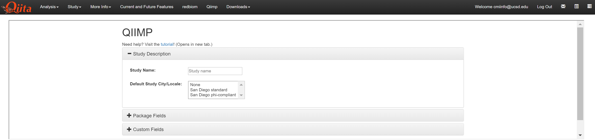
 
* When opening the page, you are shown 3 sections: Study Description, Package Fields, and Custom Fields
* Study Description: Allows you to name your metadata template and select where your study was conducted
* Package Fields: Allows you to select your default fields based on your sample type
* Custom Fields: Allows you to add new fields that were not included in the default package fields
 
Study Description
------------------------
 
This section should be opened automatically. If you have closed it, select “Study Description” to fill out this section. In this section of the metadata wizard, you describe your study and where the samples were collected.
 
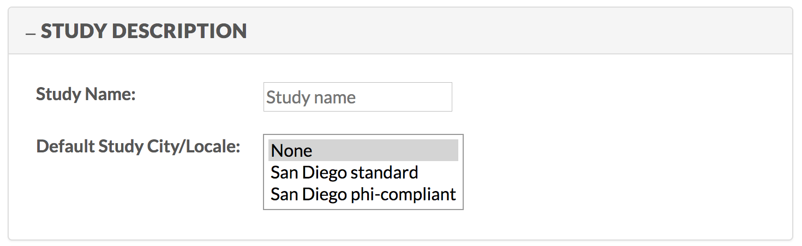
 
* Study Name: Allows you to name your metadata template

  * Only letters, numbers, and spaces are allowed in this section
  
* Any spaces will be replaced with a hyphen and all uppercase letters will be converted to lowercase in your .xlsx file name
* Default Study City/Locale: Allows you to select the location where your study was conducted

  * None: Used for studies where samples were not collected at UCSD or one of its affiliated San Diego campuses (e.g. Rady Children’s Hospital)
  
    * You will be required to supply the latitude, longitude, and elevation for each sample individually

  * San Diego Standard: Used for studies conducted at UCSD or one of its affiliated San Diego campuses
  
* All samples are given UCSD’s standard latitude, longitude, and elevation
* This is preferable to providing the precise building location on a per sample basis

  * San Diego PHI Compliant: All samples will originally be provided with UCSD standard coordinates
  
* Downstream tools will be notified to mask these coordinates with “missing: restricted access” before the data is made public
 
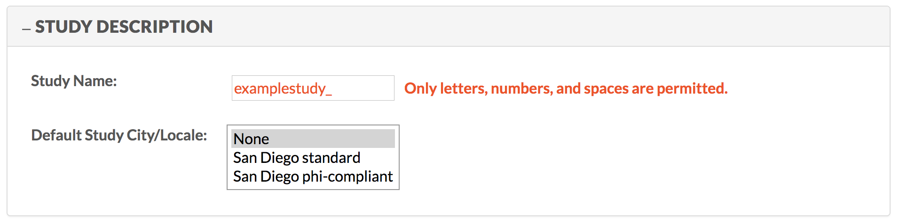
 
* If any prohibited characters are written in Study Name, an error will show up and you will not be able to create your metadata template

  * Note that an error will not appear until a new field, such as “Default Study City/Locale”, is selected
 
Package Fields
---------------------
 
Select “Package Fields” to fill out this section. In this section of the metadata wizard, when you select your sample type,  a set of default fields will be added to your metadata template.
 
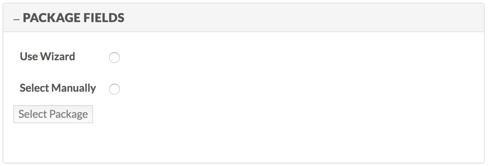
 
* Use Wizard: Use the wizard to select your fields by first selecting the host/environment then selecting the sample type
* Select Manually: Manually select your fields by looking at a list of each sample type
* You may only use one of these options
 
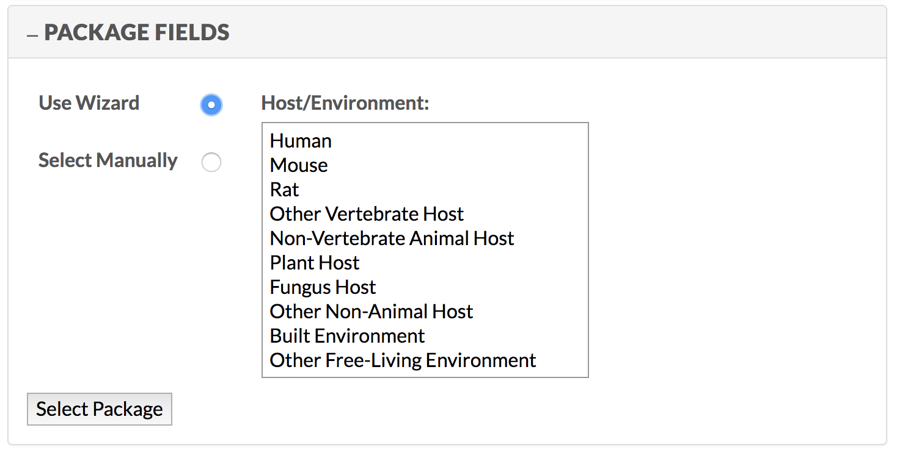
 
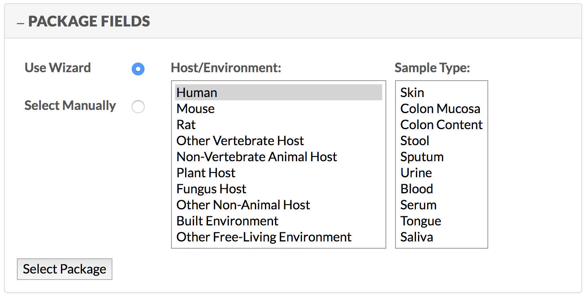
 
* If you select “Use Wizard”, you must go through 2 layers to select your sample type.

  * First you must choose your “host/environment” which will then prompt a “sample type” tab to open
  * You will be able to choose your final sample type in this secondary  sample type tab
 
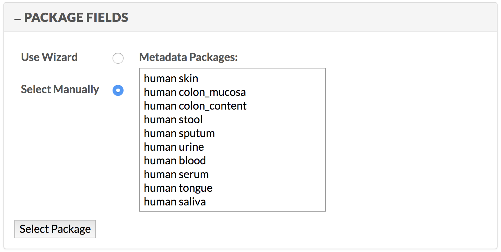
 
* If you use “Select Manually”, you are given every sample type available to choose from
 
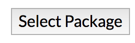
 
* Once you choose your sample type, select “Package.”
 
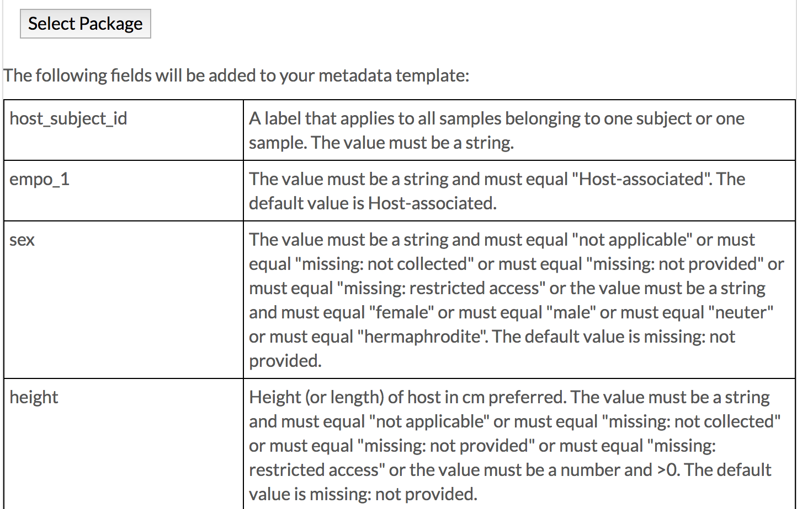
 
* You will then be given a table giving you all of the fields that will be automatically added to your metadata template
* Each field will be given a description of how these fields should be filled out and some will have accompanying definitions
 
Custom Fields
-------------------
 
Now that you have your default fields added to your metadata template, you can add your custom fields, if you have any. Select “Custom Fields” to fill out this section.
 
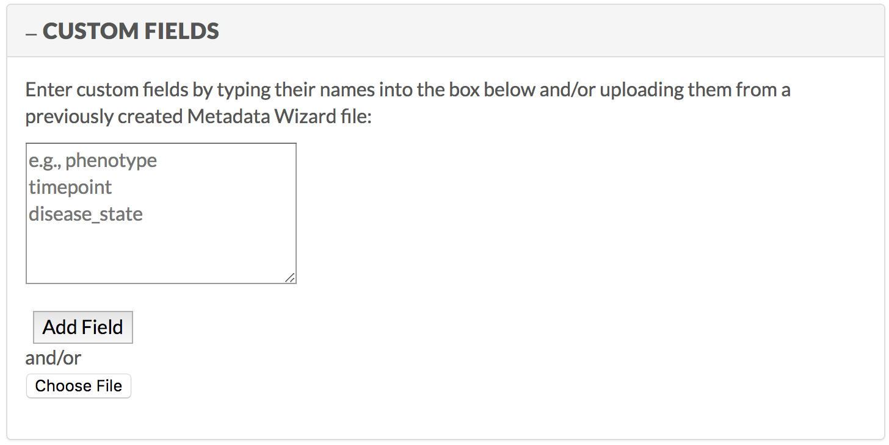
 
* Within the given table, insert the names of the fields you want to add to your metadata template separated 
 
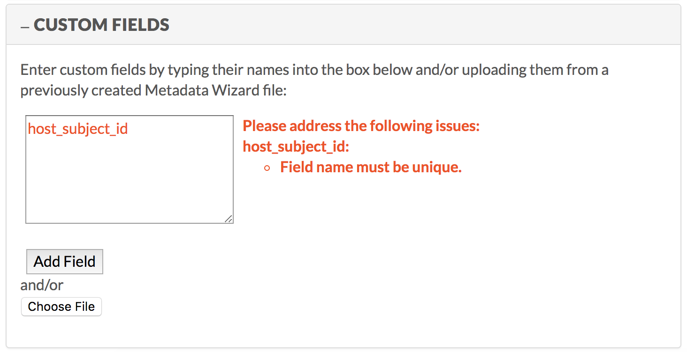
 
* Be sure to look at all of the default fields that were added in the “Package Fields” section because you will get an error if you try to add them to your metadata template again
 
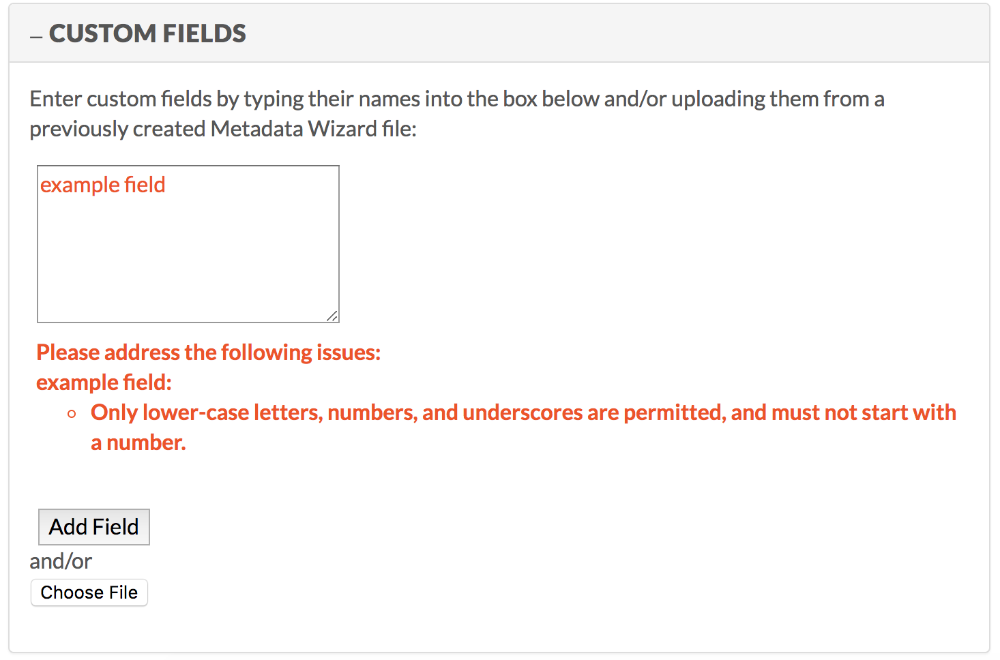
 
* When you try to add a unique field, there are a few restrictions regarding new file names

  * No uppercase letters or spaces are allowed, and the field cannot start with a number
 
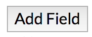
 
* Once you do create a unique field (or multiple unique fields), select “Add Field”

  * If adding multiple unique fields at a time, be sure to put each field on a separate line
 
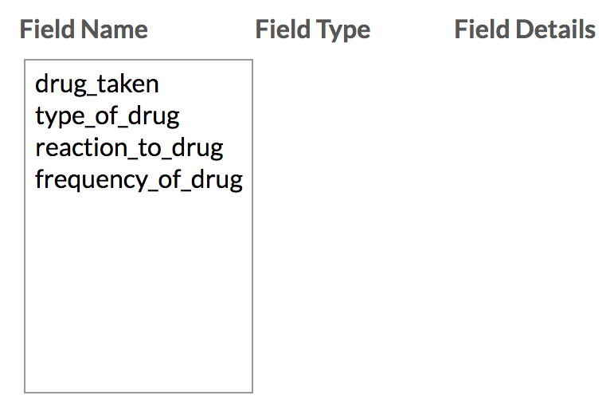
 
* This will prompt 3 columns to appear below “Choose File”

  * Field Name: The custom field names added to the metadata template
  * Field Type: The type of field the selected field is
  * Field Details: The details you fill out about the added field

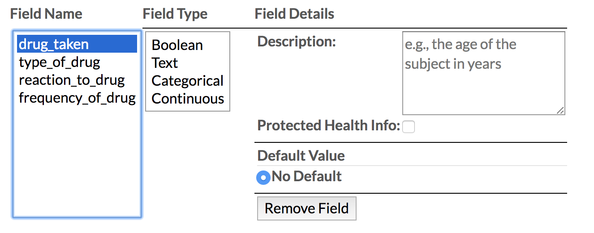

* Select the field that you would like to add more information to

  * This will open up text boxes for you to fill in both Field Type and Field Details 
 
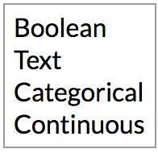

* Field Type has 4 options

  * Boolean
  * Text
  * Categorical
  * Continuous
 
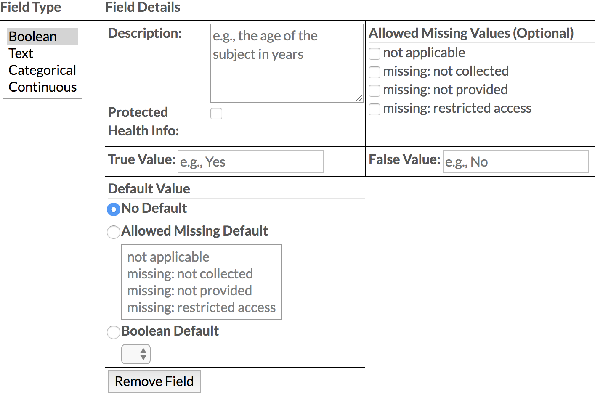
 
* Boolean: A data type with only 2 possible options

  * Description: A description of your field
  * Protected Health Information: Labels this field as PHI or not
  * Allowed Missing Values (Optional): The values allowed if this field is not included for a sample
  * True Value: The true option of the 2 Boolean values
  * False Value: The false option of the 2 Boolean values
  * Default Value: The value that will be automatically inserted into the cell once a sample is added
 
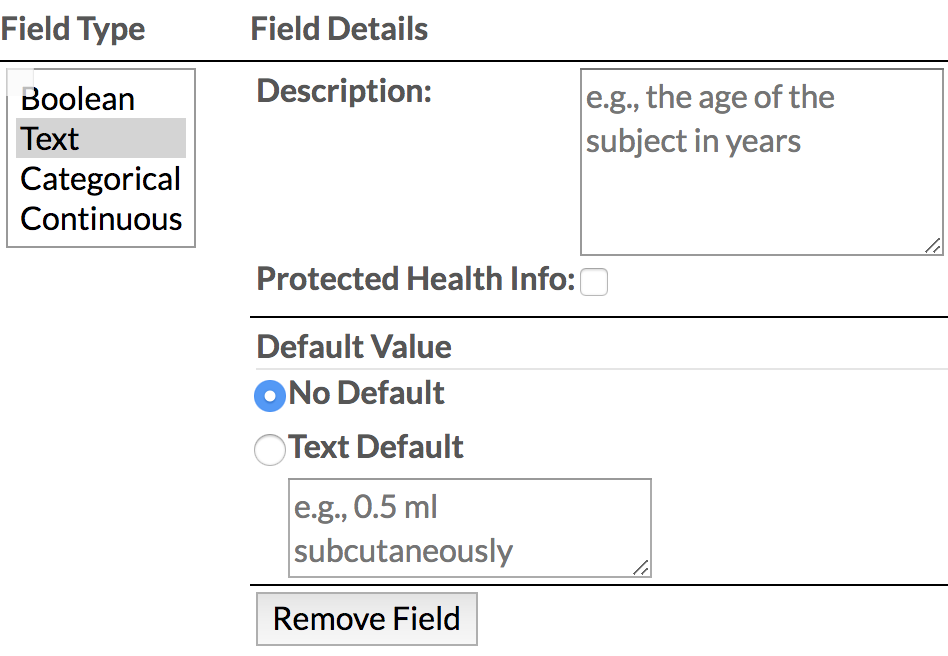
 
* Text: A description of the sample

  * Description: A description of your field
  * Protected Health Information: Labels this field as PHI or not
  * Default Value: The value that will be automatically inserted into the cell once a sample is added
 
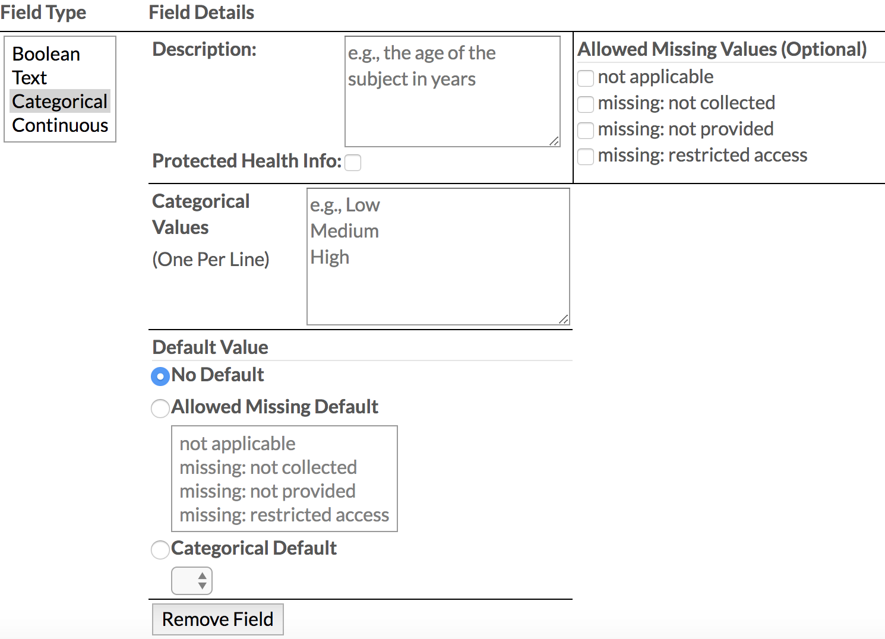
 
* Categorical: A data type with multiple options

  * Description: A description of your field
  * Protected Health Information: Labels this field as PHI or not
  * Allowed Missing Values (Optional): The values allowed if this field is not included for a sample
  * Categorical Value: The data type options
  * Make sure that each type is on a different line
  * Default Value: The value that will be automatically inserted into the cell once a sample is added
 
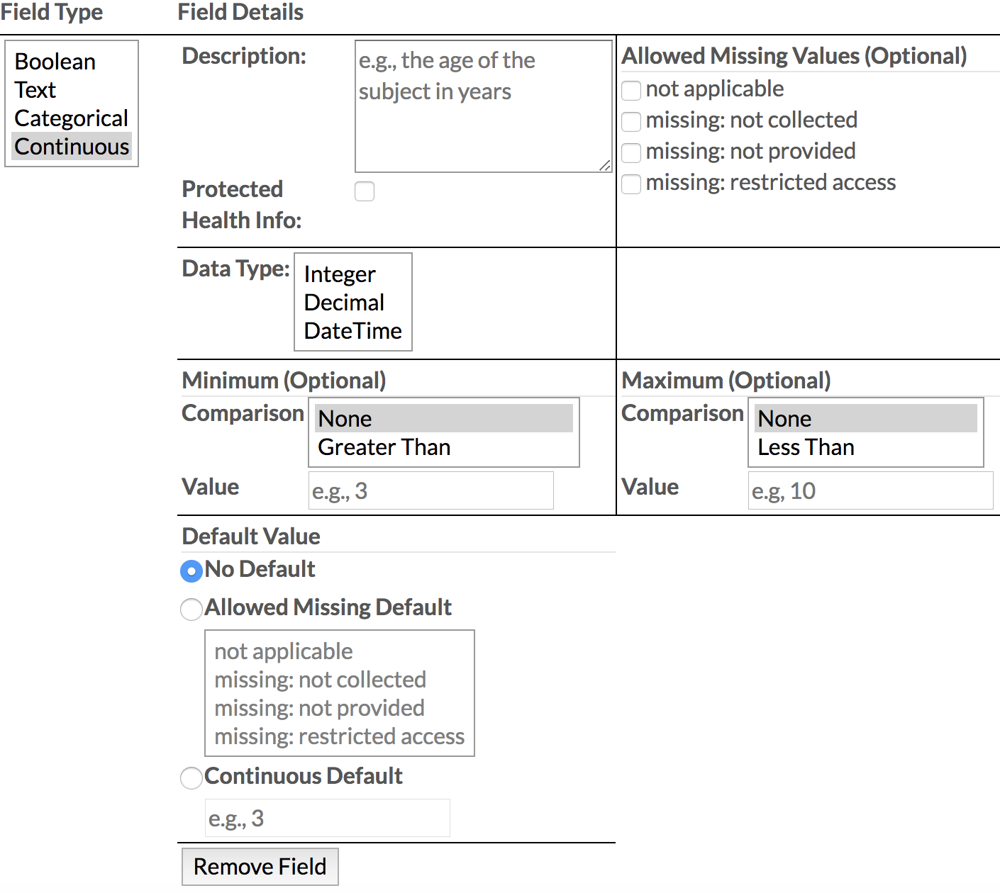
 
* Continuous: A data type measured on a continuous range

  * Description: A description of your field
  * Protected Health Information: Labels this field as PHI or not
  * Allowed Missing Values (Optional): The values allowed if this field is not included for a sample
  * Data Type: The measurement of the field
  
    * Units: The units for the data type
                                	
      * Only required for “Integer” and “Decimal”
      
    * Minimum (Optional): The minimum number the value must be

      * Comparison: How the sample’s value compares to the minimum value
      * Value: The minimum value
        
	* Required if a comparison is chosen
        	
    * Maximum (Optional): The maximum number the value must be

      * Comparison: How the sample’s value compares to the maximum value
                    	
        * Value: The maximum value

          * Required if a comparison is chosen

    * Default Value: The value that will be automatically inserted into the cell once a sample is added
 
* Fill out each field with the information it has asked for 

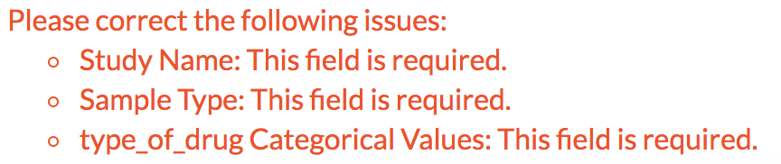
 
* If at any point in filling out the metadata wizard you have made a mistake or left a required field empty, an error box will show at the bottom of the screen telling you the exact error and where it can be found.

* If you already have an excel sheet made with the Metadata Wizard, you can also use that to create your custom fields
  
  * This file MUST be created with the Metadata Wizard

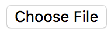

* To upload your excel file, select the “Choose File” button to bring up your computer’s file to choose from
* Once a file has been chosen, select “Open” to add the file to your computer
* The metadata fields, field types, and field descriptions will all be filled in based on your already made metadata excel file
 
Submitting Your Data
----------------------------
 
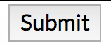
 
* Once all of your fields have been filled out, select the submit button at the bottom of the screen.
 
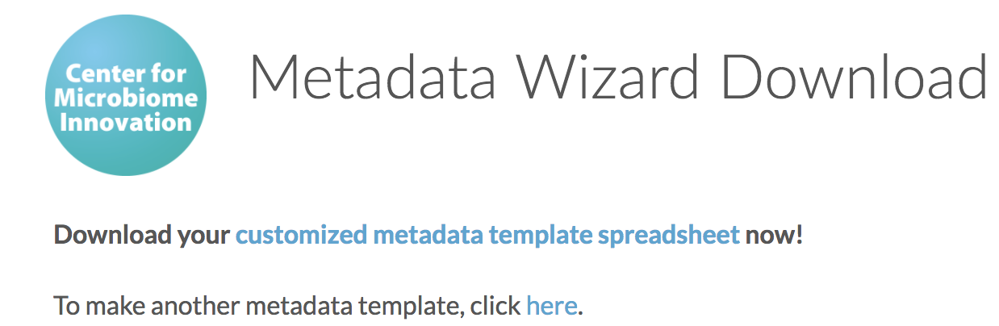
 
* This will bring you to a new page where you can download your metadata template or make a new template
        	
  * Customized metadata template spreadsheet: Download the metadata sheet created
  * Here: Return to the metadata wizard to create a new metadata template

Your Metadata Spreadsheet
--------------------------------------
 
* Once you download your metadata spreadsheet, you will notice it has 6 tabs 
* Metadata: This tab contains the metadata fields you added as column headings

  * When you select a cell in this tab, you will be notified of the description of the field as well as what type of data and null values can be inserted
  * If the information inserted is incorrect, you will receive a notification explaining the error made

    * However, if you copy-and-pasted information from a different excel sheet to this sheet, you will no longer receive error notifications
    
* Validation: This tab alerts you of errors made within the Metadata tab
  
  * The cells with errors will be marked with a red coloring while cells without errors will be marked with a green coloring
  * Only rows and fields with errors in them will be displayed
  * To return to the errored cell within the metadata tab, simply select the “Fix” hyperlink within the red cell to be brought there
  * Unlike the metadata tab, if you copy-and-paste information into your metadata tab, you will still see where the errors are 

* Field Descriptions: This tab contains the descriptions of the default and custom fields
* Metadata_schema: *These are exposed during development and will be hidden in the final version*
* Metadata_form: *These are exposed during development and will be hidden in the final version*
* readme: This tab contains instructions on filling our the metadata spreadsheet as well as information on when the spreadsheet was created

* To upload your file to Qiita, you must return to the metadata tab and “Save As” a .txt or .tsv file  
* .xlsx files cannot be uploaded to Qiita
